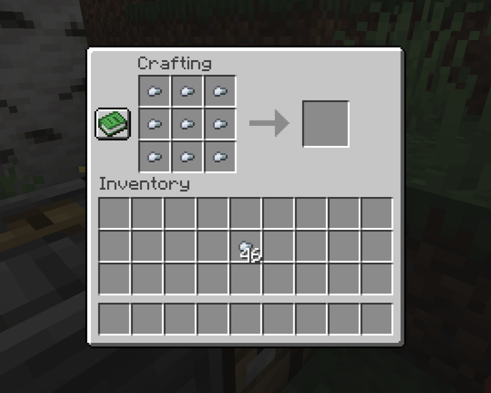

## Restricted Crafting Mod

This mod allows you to restrict crafting of items based on permissions.  
You can restrict crafting of any recipe by adding a permission node `restricted-crafting.<recipe_id>`.  
For example, to restrict crafting of iron ingots from nuggets, add `restricted-crafting.minecraft:iron_ingot_from_nuggets` with value `false`.

You can find all recipe ids in `server.jar/META-INF/versions/<version>/server-<version>.jar/data/minecraft/recipes/` folder or in this [repository](https://github.com/misode/mcmeta/tree/data-json/data/minecraft/recipe).

To restrict crafting for Crafter, add a permission node `restricted-crafting.crafter.<recipe_id>` in `default` LuckPerms group.

### Dependencies

This mod requires:
- `Fabric API` [CurseForge](https://www.curseforge.com/minecraft/mc-mods/fabric-api), [Modrinth](https://modrinth.com/mod/fabric-api)
- `LuckPerms` [LuckPerms](https://luckperms.net/), [CurseForge](https://www.curseforge.com/minecraft/mc-mods/luckperms), [Modrinth](https://modrinth.com/mod/luckperms)